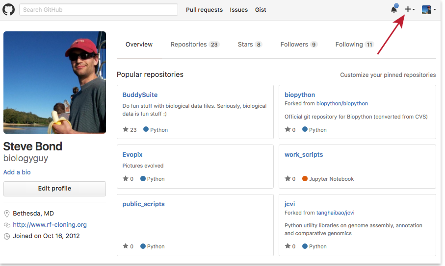
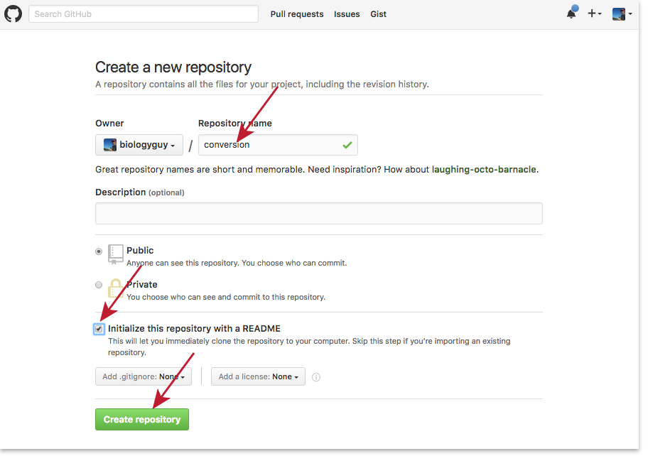
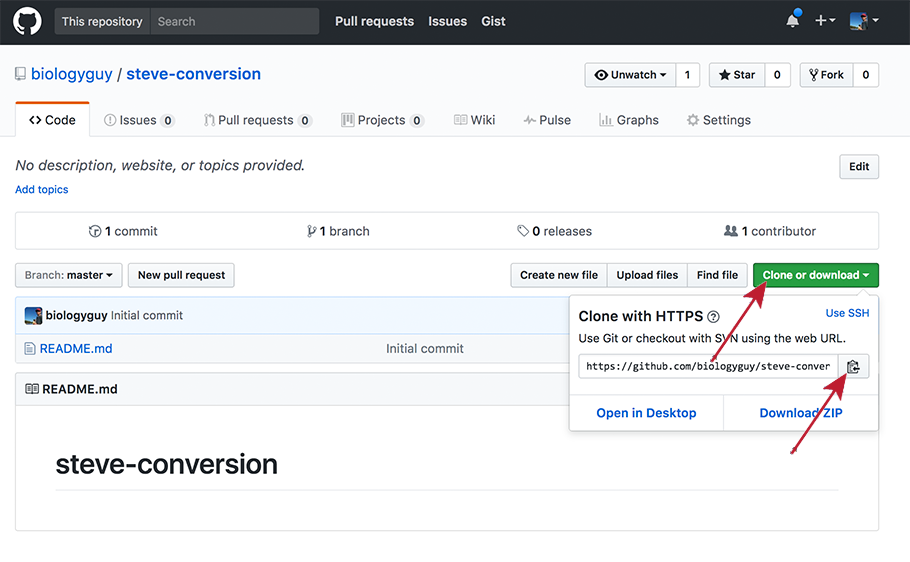

Once Git is configured, we can start using it. We are going to be looking
 at everything through the lens of [GitHub](https://github.com/), which
 is a highly popular online repository host that makes creating and
 managing repositories very easy. Be aware that everything we do
 on the website is also available from the command line, but we are going
 to gloss over most of those details during the workshop.

Open your web browser to [GitHub](https://github.com/) and log in (or
 create an account if necessary)
 
From your main dashboard, click on the little '+' drop-down menu and
 select 'New repository'
 

&nbsp;

Name your repository "[your name]-conversion" (replacing [your name]
 with your actual name), select "Public", check "Initialize this repository
 with a README", and click "Create Repository"

&nbsp;

As soon as the repository is created, GitHub displays a page with a URL
 and some information on how to configure your local repository:

&nbsp;

Copy the URL provided and clone the repository onto your computer by
 running the following command (make sure to replace the url!):

~~~
$ git clone https://your_repository's_url
$ cd your_repository
$ ls -a
~~~
{: .bash}

We should see a pristine Git repository with a README file:

~~~
.	..	.git	README
~~~
{: .output}

Git stores information about the project in the special .git
 sub-directory. If we ever delete it, we will lose the project's history.

We can check that everything is set up correctly by asking Git to tell
 us the status of our project:

~~~
$ git status
~~~
{: .bash}

~~~
# On branch master
#
# Initial commit
#
nothing to commit (create/copy files and use "git add" to track)
~~~
{: .output}
