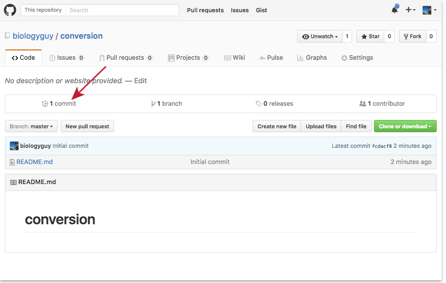
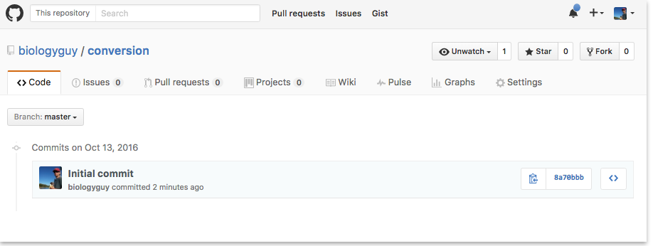
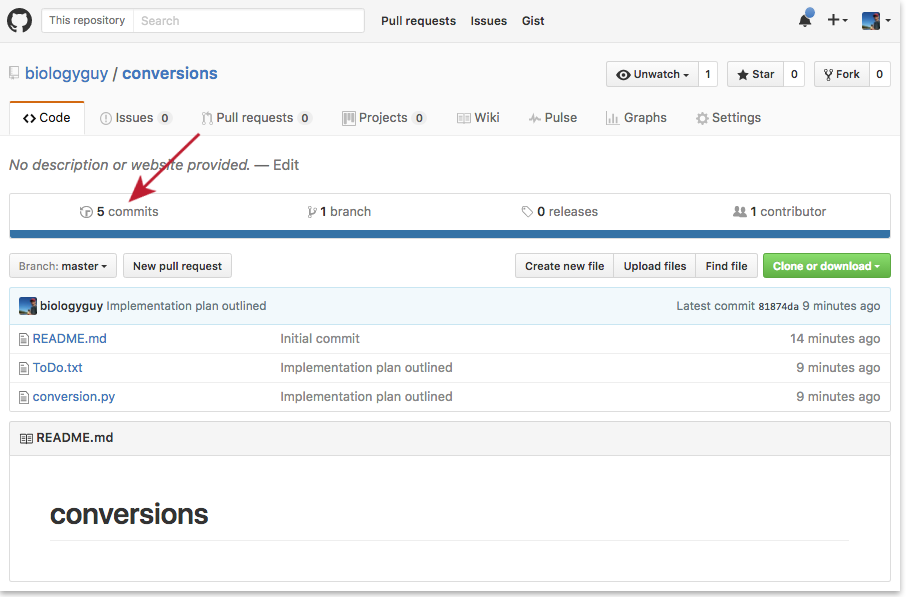
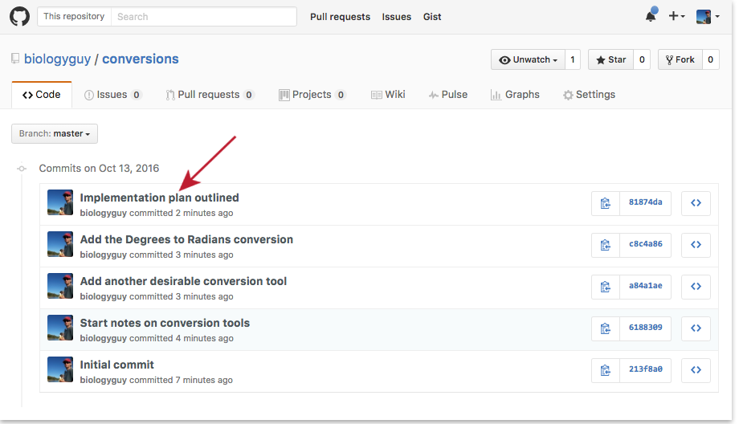
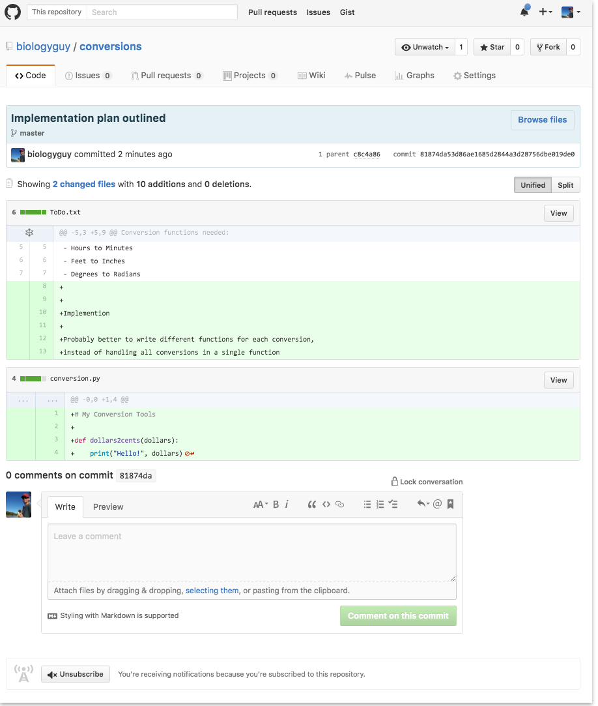
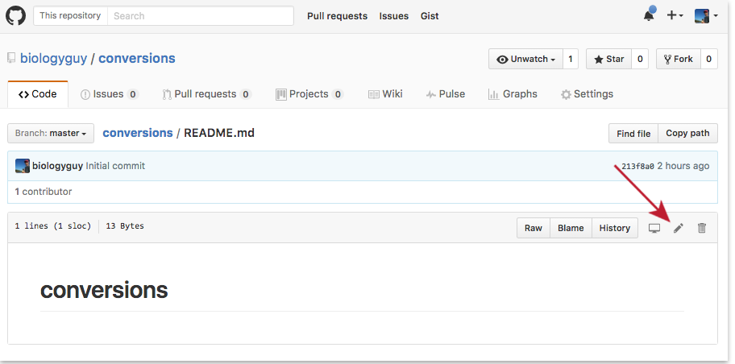
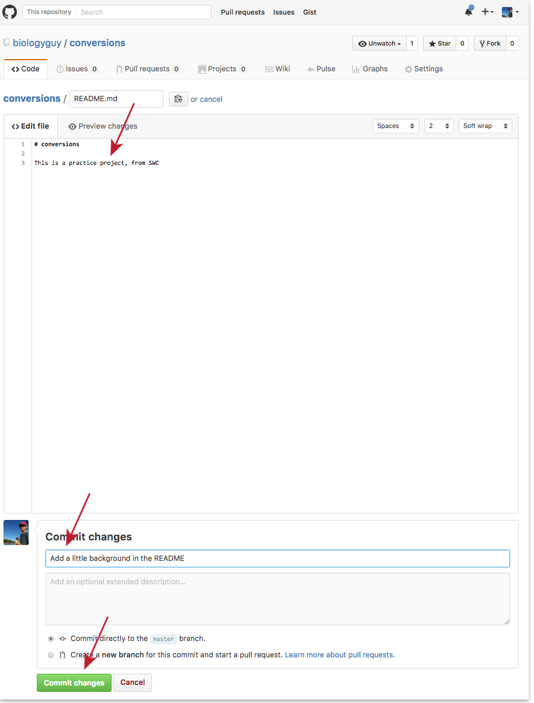

Version control really comes into its own when we begin to collaborate with
other people.  We already have most of the machinery we need to do this; the
only thing missing is to copy changes from one repository to another.

Systems like Git allow us to move work between any two repositories.  In
practice, though, it's easiest to use one copy as a central hub, and to keep it
on the web rather than on someone's laptop.

## Pushing to GitHub

Aside from creating the conversions repository, we have not actual
 modified the GitHub version. All of our commits have been **local**. To
 demonstrate this, log into your GitHub account and navigate to the
 conversions repository. Click on the 'commit' tab

&nbsp;

Notice that there is only a single item in the commit history:

&nbsp;

Only the version of the repository on your laptop knows that other files
 have been added, so we must '`push`' those changes up to the remote repository.
 
~~~
$ git push
~~~
{: .bash}

~~~
Counting objects: 13, done.
Delta compression using up to 24 threads.
Compressing objects: 100% (13/13), done.
Writing objects: 100% (13/13), 1.33 KiB | 0 bytes/s, done.
Total 13 (delta 3), reused 0 (delta 0)
remote: Resolving deltas: 100% (3/3), done.
To https://github.com/biologyguy/conversions.git
   213f8a0..81874da  master -> master
~~~
{: .output}

&nbsp;

Now all of the changes have been uploaded to GitHub:

&nbsp;

Click on one of the commit messages for a full breakdown of what that
 commit includes

&nbsp;

From this view, you can see that two files were modified in this commit,
 and the specific changes are displayed (here there are only additions,
 shown in green, but removed lines will be rendered in red)

&nbsp;

## Pulling from GitHub

If you are working on a repository from multiple computers, or are
 collaborating with others, you will also need to retrieve commits that
 have been saved to the remote repository.
 
Click on the README.md file in your conversions repository, and then
 click on the little pencil to modify it.
 

&nbsp;

Add some text that describes your repository to visitors. The README is
 a very common component in software projects, and 
 [GitHub will render](https://github.com/adam-p/markdown-here/wiki/Markdown-Cheatsheet)
 markdown that is contained in the README if the .md is appended to the
 end.

This view allows you to create a commit, just like you did from your
 terminal window. So include a useful commit message and then click
 the 'Commit changes' button.

&nbsp;

If you go back to the list of commits, you'll see that there is now one
 more than there was a moment ago.
 
Back in your local repository, use the '`pull`' command to retrieve this
 new commit.
 
~~~
$: git pull
~~~
{: .bash}

~~~
remote: Counting objects: 3, done.
remote: Compressing objects: 100% (3/3), done.
remote: Total 3 (delta 0), reused 0 (delta 0), pack-reused 0
Unpacking objects: 100% (3/3), done.
From https://github.com/biologyguy/conversions
   81874da..2e763f1  master     -> origin/master
Updating 81874da..2e763f1
Fast-forward
 README.md | 4 +++-
 1 file changed, 3 insertions(+), 1 deletion(-)
~~~
{: .output}

You should make a habit of always pulling from the remote repository
 before you start working on any files in it. It doesn't hurt anything
 if no files have been changes, but it can prevent merge conflicts
 later on if they have.

> ## GitHub GUI
>
> Browse to your `conversions` repository on GitHub.
> Under the Code tab, find and click on the "commits" tab.
> Hover over, and click on, the three buttons to the right of each commit.
> What information can you gather/explore from these buttons?
{: .challenge}

> ## Push vs. Commit
>
> In this lesson, we introduced the "git push" command.
> How is "git push" different from "git commit"?
>
> > ## Solution
> >
> > "`git commit`" saves an actual snapshot of some changes, while
> > "`git push`" sends those changes to the remote copy of the repository
> {: .solution}
{: .challenge}
